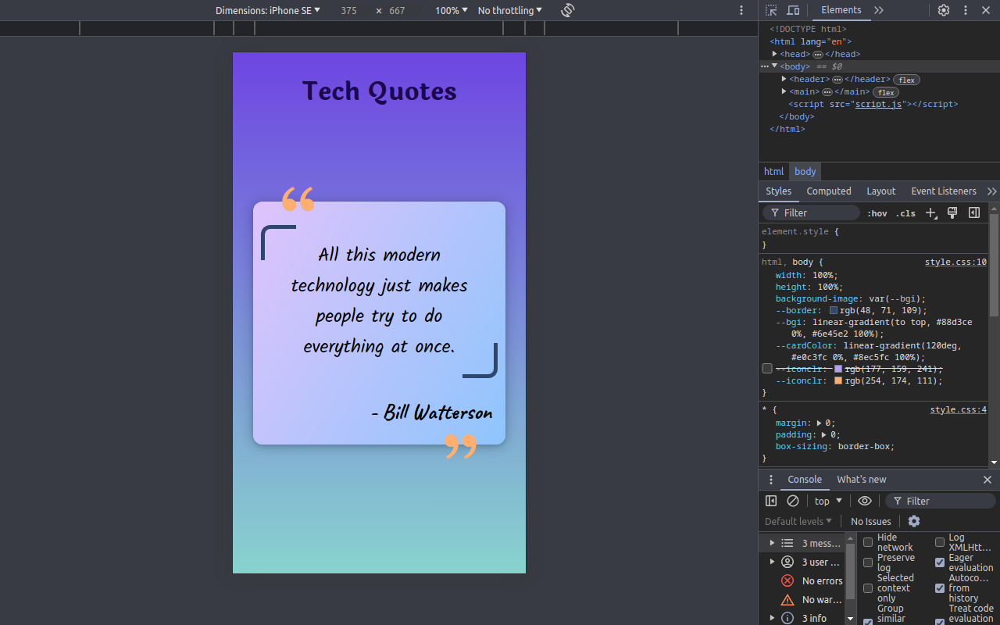

# Tech Quotes

Welcome to **Tech Quotes**! This web application provides a random technology-related quote along with the author's name every time you refresh the page or open the link.

## Features

- **Random Tech Quotes**: Get a new tech-related quote on each refresh.
- **Author Attribution**: Each quote is accompanied by the author's name.
- **Responsive Design**: The application looks great on both desktop and mobile devices.
- **Modern UI**: Clean, intuitive, and user-friendly interface.

## Live Demo

Check out the live version of the Web page here: [Tech Quotes](https://dheerajray-01.github.io/Tech-Quote/)

## Screenshots

### Desktop View


### Mobile View


## Installation

1. **Clone the repository**:
    ```sh
    https://github.com/DheerajRay-01/Tech-Quote.git
    ```
2. **Navigate to the project directory**:
    ```sh
    cd Tech-Quote
    ```
3. **Open the `index.html` file in your browser**:
    ```sh
    open index.html
    ```

## Usage

- **Refresh the page**: Each refresh will display a new random technology quote.
- **Responsive Design**: Use it on any device; the application is fully responsive.

## Contributing

1. **Fork the repository**
2. **Create your feature branch** (`git checkout -b feature/AmazingFeature`)
3. **Commit your changes** (`git commit -m 'Add some AmazingFeature'`)
4. **Push to the branch** (`git push origin feature/AmazingFeature`)
5. **Open a Pull Request**


## Contact

**Dheeraj Ray** - [Dheerajray2003@gmail.com](mailto:dheerajray2003@gmail.com)
